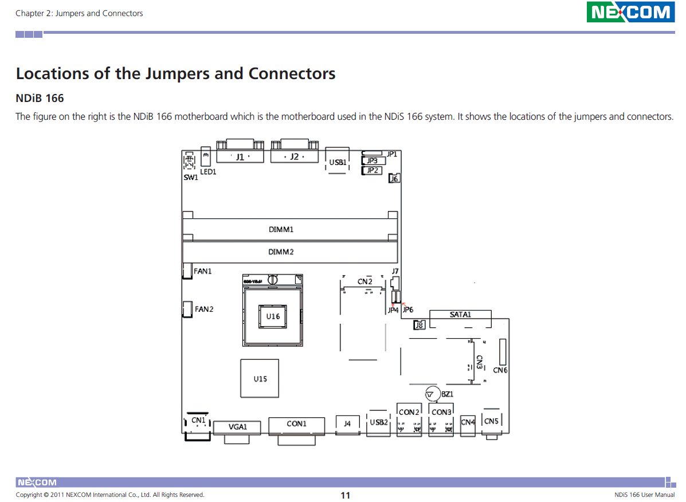

# Gpio configuration for Nexcom NDiS 166 industrial PC

## The gpio chip is a IT8728 Super I/O chip

## The gpio connector is JP3 2.54 mm 3.3 volts level

## connector pin to gpiod mapping

### pin 1 to gpio 20

### pin 2 to gpio 21

### pin 3 to gpio 22

### pin 4 to gpio 23

### pin 5 to gpio 1

### pin 6 to gpio 2

### pin 7 to gpio 4

### pin 8 to gpio 16

### pin 9 to VCC 3.3 volt

### pin 10 to VCC 3.3 volt

### pin 11 to GND

### pin 12 to GND

