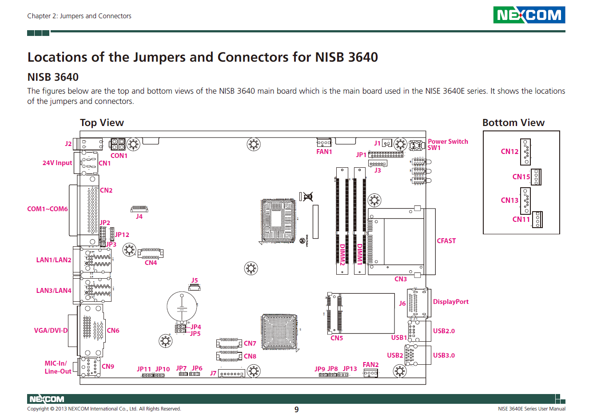
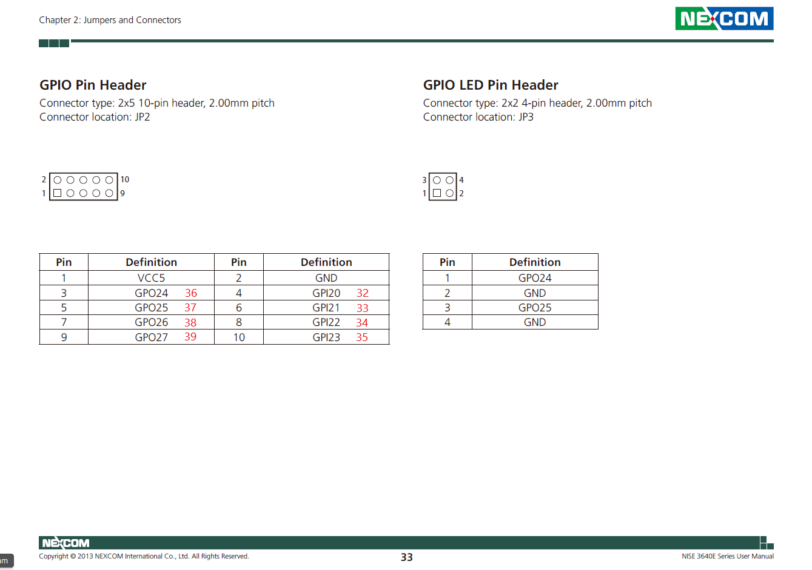

# Gpio configuration for Nexcom NISE 3640E industrial PC

## The gpio chip is a IT8783E Super I/O chip

## The gpio connector is JP2 2mm 5 volts level

## connector pin to gpiod mapping

### 3 to 36

### 4 to 32

### 5 to 37

### 6 to 33

### 7 to 38

### 8 to 34

### 9 to 39

### 10 to 35

